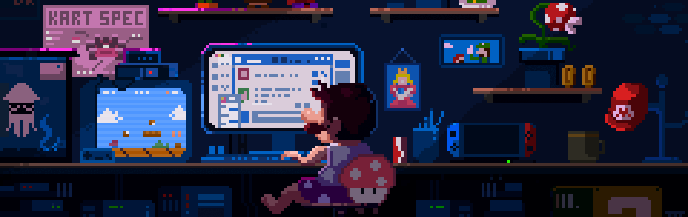

  

    
  

  <h1 style="border-bottom: 3px solid #58a6ff; display: inline-block; padding-bottom: 10px;">
    Всем привет 🤞
  </h1>

## Обо мне
Меня зовут Андрей, я фронтенд-разработчик с `passion` для создания интуитивных и отзывчивых интерфейсов. Люблю работать с `React/Next.js`, оптимизировать производительность и воплощать дизайны в жизнь.

🔮 Из бывшего ревизора в IT-энтузиаста: однажды осознал, что хочу создавать цифровые миры, а не только проверять отчеты.

### 🔗 Соцсети

## 🛠 Мой стек технологий

### Frontend

### Backend & Tools

### Инструменты

## 📈 Моя статистика GitHub

